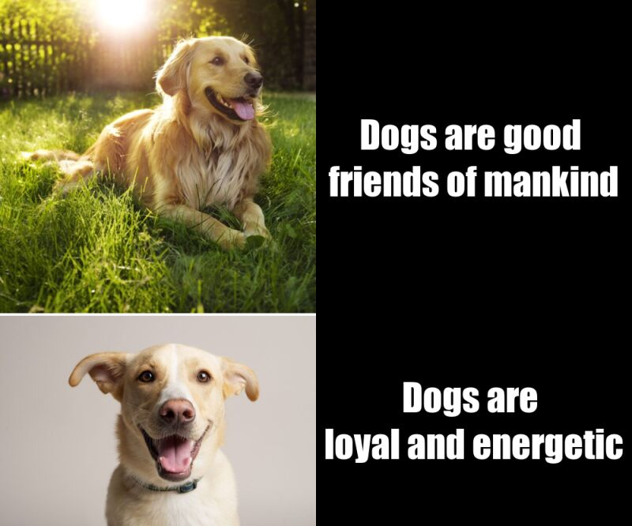

# Motivation of creating this meme
I like dogs very much. Although I have never owned them, I have many friends who have dogs at home. I think it's a very happy thing to see them have a happy life and play with dogs

# This meme is original
I made this meme by myself through the practice of Lab. Because the scale of the image are different,I need to adjust the size of the text plate to match the size of the picture plate, which takes me some time, so this must be my original

# My code

```
library(magick)
# square one
dog_1 <- image_read("https://hips.hearstapps.com/hmg-prod.s3.amazonaws.com/images/golden-retriever-royalty-free-image-506756303-1560962726.jpg?crop=0.672xw:1.00xh;0.166xw,0&resize=640:*") %>%
  image_scale(500)

#square two
text_1 <- image_blank(width = 500, 
                          height = 500, 
                          color = "#000000") %>%
  image_annotate(text = "Dogs are good \nfriends of mankind",
                 color = "#FFFFFF",
                 size = 60,
                 font = "Impact",
                 gravity = "center")

# square three
dog_2 <- image_read("https://i.pinimg.com/originals/9f/41/28/9f41288d76605c8ff85171207f5745ae.jpg") %>%
  image_scale(500)

# square four
text_2 <- image_blank(width = 500, 
                       height = 333, 
                       color = "#000000") %>%
  image_annotate(text = "Dogs are \nloyal and energetic",
                 color = "#FFFFFF",
                 size = 60,
                 font = "Impact",
                 gravity = "center")

# making each row

# first row
top_row <- image_append(c(dog_1, text_1))

# second row
bottom_row <- image_append(c(dog_2, text_2))

# making the whole thing!

meme <- c(top_row, bottom_row) %>%
  image_append(stack = TRUE) %>%
  image_scale(800)

image_write(meme, "my_meme.png")
```
